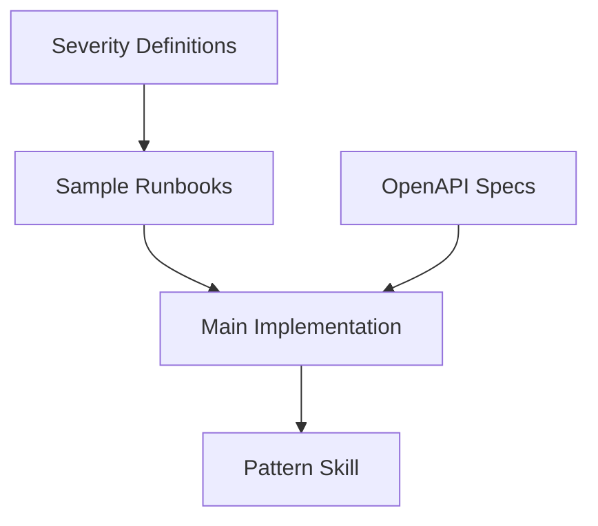

# Pre-Work Planning Guide

This guide helps you identify, prioritize, and plan pre-work that maximizes project success.

---

## What is Pre-Work?

Pre-work is **foundation building** that happens before main execution begins. It addresses gaps that would otherwise cause friction, delays, or rework during implementation.

### Pre-Work vs. Implementation

| Pre-Work | Implementation |
|----------|----------------|
| Creates foundations | Uses foundations |
| Removes ambiguity | Executes with clarity |
| Documents decisions | Implements decisions |
| Enables success | Achieves success |

---

## Pre-Work Categories

### 1. Foundation Documents

**Purpose:** Establish shared understanding and remove ambiguity.

#### Examples
- **Severity Definitions** - P1-P4 criteria, response times, escalation rules
- **Role Matrices** - Who can do what, approval authorities
- **Glossary** - Domain-specific terms and their meanings
- **SLA/SLO Targets** - Performance expectations

#### Template

```markdown
### Pre-Work: [Document Name]

**File:** `docs/[category]/[name].md`
**Blocks:** Phases [X, Y, Z]
**Effort:** [Low/Medium/High]

**Content:**
- Section 1: [description]
- Section 2: [description]
- Section 3: [description]

**Definition of Done:**
- [ ] All sections complete
- [ ] Reviewed by [stakeholder]
- [ ] Referenced in plan
```

---

### 2. Reference Artifacts

**Purpose:** Provide authoritative sources for implementation.

#### Examples
- **OpenAPI Specs** - External API definitions
- **Sample Data** - Test fixtures, example payloads
- **Configuration Templates** - Environment configs
- **Schema Definitions** - Data structures

#### Template

```markdown
### Pre-Work: [Artifact Name]

**File:** `[path/to/artifact]`
**Format:** [OpenAPI/JSON/YAML/etc.]
**Source:** [URL or description]
**Blocks:** Phases [X, Y, Z]

**Purpose:**
[Why this artifact is needed]

**Validation:**
- [ ] Schema is valid
- [ ] Covers all required operations
- [ ] Examples are accurate
```

---

### 3. Enabling Skills

**Purpose:** Capture knowledge to prevent repeated research and ensure consistency.

#### Examples
- **Pattern Skills** - How to implement specific patterns
- **Integration Skills** - How to integrate with specific services
- **Process Skills** - How to follow specific procedures

#### Template

```markdown
### Pre-Work: Skill - [Skill Name]

**Location:** `.cursor/skills/[skill-name]/`
**Blocks:** Phases [X, Y, Z]
**Effort:** [Low/Medium/High]

**Skill Contents:**
- When to Use: [scenarios]
- Instructions: [key steps]
- References: [supporting docs]

**Why This Skill:**
[What friction it prevents]

**Definition of Done:**
- [ ] SKILL.md created
- [ ] References added
- [ ] Tested by using it
```

---

### 4. Architecture Records

**Purpose:** Document significant decisions and their rationale.

#### Examples
- **ADRs** - Technology choices, integration strategies
- **Sequence Diagrams** - Complex interaction flows
- **Data Flow Diagrams** - How data moves through the system

#### Template

```markdown
### Pre-Work: ADR - [Decision Title]

**File:** `docs/adr/ADR-XXX-[title].md`
**Blocks:** Phases [X, Y, Z]

**ADR Structure:**
- **Status:** Proposed/Accepted/Deprecated
- **Context:** Why this decision is needed
- **Decision:** What we decided
- **Consequences:** What follows from this decision

**Key Questions to Answer:**
- What alternatives were considered?
- What constraints drove the decision?
- What are the trade-offs?
```

---

### 5. Sample Implementations

**Purpose:** Provide concrete examples that demonstrate patterns.

#### Examples
- **Sample Runbooks** - Executable operational procedures
- **Example Configs** - Working configuration files
- **Test Cases** - Representative test scenarios

#### Template

```markdown
### Pre-Work: Sample - [Sample Name]

**Location:** `[path/to/samples/]`
**Count:** [number] samples
**Blocks:** Phases [X, Y, Z]

**Samples to Create:**
1. [Sample 1] - [purpose]
2. [Sample 2] - [purpose]
3. [Sample 3] - [purpose]

**Requirements:**
- [ ] Each sample is self-contained
- [ ] Each sample is tested/validated
- [ ] Each sample is documented
```

---

## Prioritization Framework

### Priority Levels

| Priority | Criteria | When to Do |
|----------|----------|------------|
| P0 - Blocker | Execution cannot start without this | Before Phase 1 |
| P1 - High | Execution will be significantly slowed | Before Phase 1 |
| P2 - Medium | Causes friction but workaroundable | During early phases |
| P3 - Low | Nice to have, improves quality | When convenient |

### Prioritization Questions

1. **Does any phase depend on this?** → Likely P0/P1
2. **Will multiple people/phases use this?** → Likely P1/P2
3. **Can we work around not having this?** → If no, P0/P1
4. **Will this prevent rework?** → If yes, consider higher priority
5. **Is this a one-time use?** → If yes, consider P2/P3

---

## Pre-Work Execution

### Ordering Pre-Work

```
1. P0 items (blockers) - MUST complete before starting
2. P1 items (high) - SHOULD complete before starting
3. P2 items (medium) - Complete during early phases
4. P3 items (low) - Complete when convenient
```

### Dependency-Based Ordering

Beyond priority, order by dependencies:

#### Step 1: Map Dependencies

For each pre-work item, ask: "What other pre-work do I need first?"

```
Example:
- Severity definitions → (no deps)
- Sample runbooks → needs severity definitions
- Pattern skill → needs implementation to document
- OpenAPI specs → (no deps)
```

#### Step 2: Build Dependency Graph



#### Step 3: Identify Parallel Execution

Items with no mutual dependencies can execute in parallel:

| Batch | Items | Why Parallel |
|-------|-------|--------------|
| Batch 1 | Severity defs, OpenAPI specs | No dependencies on each other |
| Batch 2 | Sample runbooks | Depends on Batch 1 |
| Batch 3 | Pattern skill | Depends on implementation |

#### Dependency Matrix Template

| Pre-Work Item | Depends On | Blocks | Parallelizable With |
|---------------|------------|--------|---------------------|
| [Item A] | None | Items B, C | Item D |
| [Item B] | Item A | Implementation | Item C |
| [Item C] | Item A | Implementation | Item B |
| [Item D] | None | Testing | Item A |

#### Common Dependency Patterns

| Pattern | Flow | Example |
|---------|------|---------|
| Foundation-first | Definitions → Specs → Samples | Severity → Runbook → Test |
| Spec-driven | OpenAPI → Implementation → Tests | API spec → Client → E2E |
| Knowledge-capture | Implementation → Retro → Skill | Build feature → Learn → Document |

### Pre-Work Checklist

For each pre-work item:

- [ ] **Identified** - Added to plan with priority
- [ ] **Scoped** - Clear definition of done
- [ ] **Assigned** - Owner identified
- [ ] **Estimated** - Effort level assessed
- [ ] **Tracked** - Added to project todos
- [ ] **Completed** - Verified against definition of done
- [ ] **Checkpointed** - Retrospective checkpoint created

---

## Pre-Work for Agent Success

Special consideration: What pre-work helps AI agents succeed?

### Agent-Enabling Pre-Work

| Category | Example | Why It Helps Agents |
|----------|---------|---------------------|
| Skills | Integration patterns | Agents can follow documented steps |
| Specs | OpenAPI definitions | Agents understand API contracts |
| Samples | Example code | Agents have patterns to follow |
| ADRs | Decision rationale | Agents understand constraints |
| Glossary | Domain terms | Agents use correct terminology |

### Questions for Agent Pre-Work

1. What knowledge do I (the agent) need that isn't documented?
2. What patterns will I use that should be standardized?
3. What decisions might I make incorrectly without guidance?
4. What tools/capabilities should be discoverable?

---

## Pre-Work Retrospective

After completing pre-work, checkpoint:

```markdown
## Pre-Work Checkpoint

**Date:** [date]
**Pre-Work Completed:** [list]

### Learnings
- What took longer than expected?
- What was easier than expected?
- What did we miss?

### Friction
- What gaps remain?
- What should have been pre-work?

### Opportunities
- What additional pre-work would help?
- What skills should be created from this experience?
```

---

## Example: Incident Lifecycle Pre-Work

From a real project:

### P0 - Blockers
_None identified_

### P1 - High
1. **Severity Definitions** - SRE persona needs clear P1-P4 criteria
2. **Sample Runbooks** - Runme capability needs content to execute
3. **Incident Lifecycle Skill** - Captures Phase 2 patterns for future reference
4. **ADR-002** - Documents Temporal-centric architecture decision
5. **OpenAPI Specs** - Integration capabilities need reference docs

### P2 - Medium
- Confluence page templates
- Grafana dashboard templates

### P3 - Low
- Onboarding guide
- Video walkthrough

---

## Post-Implementation: Update the Skill

After using SPP-001, reflect and improve it:

### Reflection Questions

1. **What pre-work was missing that should have been identified?**
   - Add to checklist or prompt

2. **What pre-work was identified but unnecessary?**
   - Consider removing or lowering priority guidance

3. **What dependencies were discovered during execution?**
   - Add to dependency patterns

4. **What scoring was inaccurate?**
   - Calibrate rubric

### Update Template

```markdown
## SPP-001 Skill Update

**Based on:** [Project name]
**Date:** [date]

### Additions
- [ ] New prompt for [persona]: "[question]"
- [ ] New checklist item: [item]
- [ ] New dependency pattern: [pattern]

### Removals
- [ ] Remove/demote: [item] - reason: [why]

### Calibrations
- [ ] Scoring adjustment: [description]
- [ ] Priority threshold change: [description]
```
