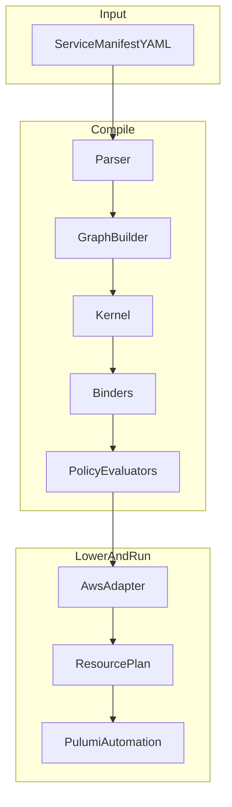

# Getting Started with Shinobi V3

This guide explains what Shinobi is, how it is structured, and how to run and deploy the current MVP.

## What Shinobi Does

Shinobi is an infrastructure compilation pipeline:

1. Parse a service manifest.
2. Build a deterministic graph snapshot.
3. Compile graph edges into backend-neutral intents.
4. Evaluate policy compliance by selected policy pack.
5. Lower intents and platform nodes to AWS resource plans.
6. Execute plan through Pulumi Automation.

The goal is to keep architecture intent, compliance, and provider mechanics separated but connected by explicit contracts.

## Core Concepts

- **Node**: A typed object in the graph (`component` or `platform`).
- **Edge**: A relationship (`bindsTo`, `triggers`, etc.) between nodes.
- **Intent**: Backend-neutral output emitted by binders (IAM, config, network, telemetry).
- **Policy Pack**: A named compliance mode (`Baseline`, `FedRAMP-Moderate`, `FedRAMP-High`).
- **Adapter**: Translates intent and graph state into provider resources.

## Architecture and Responsibilities



### Package Breakdown

- `packages/contracts`: contracts and shared types.
- `packages/ir`: graph model, IDs, canonical ordering, serialization.
- `packages/kernel`: compile orchestration.
- `packages/binder`: edge compilers for intent synthesis.
- `packages/policy`: policy evaluator and severity logic.
- `packages/validation`: schema/semantic/determinism validation.
- `packages/adapters/aws`: AWS resource lowering and deployment runtime.
- `packages/cli`: command entrypoints and user workflow.

## Current Deployable Surface (MVP)

### Supported platform lowering

- `aws-lambda`
- `aws-sqs`
- `aws-dynamodb`
- `aws-s3`
- `aws-apigateway`

### Supported cross-resource wiring

- Lambda -> SQS event source mapping for `bindsTo`.
- API Gateway -> Lambda integration/route/permission for `triggers`.
- Config intents to SSM parameters.
- IAM intents to role/policy/attachments.

### Current explicit limitations

- Network intents are accepted but not lowered to deployable network resources; adapter emits warning diagnostics.
- Telemetry intents are currently skipped in adapter lowering.

## Manifest Model

A service manifest includes:

- `service` name
- `components` list
- `bindings` list
- optional `policyPack`

Minimal shape:

```yaml
service: my-service
components:
  - id: api
    type: component
    platform: aws-lambda
bindings:
  - source: api
    target: queue
    type: bindsTo
    config:
      resourceType: queue
```

Reference examples:

- `examples/lambda-sqs.yaml`
- `examples/apigw-dynamodb.yaml`

## Patterns You Will See

### Pattern 1: Component bindsTo Platform

`bindsTo` usually produces:

- IAM intent for access
- optional config intents (env/parameter wiring)
- optional network intent metadata

### Pattern 2: Platform triggers Component

`triggers` usually produces:

- invoke IAM intent
- config intents for trigger metadata
- adapter-generated integration resources (for supported platforms)

### Pattern 3: Deterministic output

Shinobi enforces deterministic ordering and stable IDs so repeated identical inputs produce byte-stable outputs.

## Running the Platform Locally

## 1) Prerequisites

- Node and pnpm installed.
- AWS credentials available in your shell.
- Pulumi CLI installed and available in `PATH`.

## 2) Install and build

```bash
pnpm install
pnpm nx build cli
```

## 3) Validate

```bash
node packages/cli/dist/main.js validate examples/lambda-sqs.yaml
```

## 4) Plan

```bash
node packages/cli/dist/main.js plan examples/lambda-sqs.yaml --region us-east-1
```

## 5) Preview (safe)

```bash
node packages/cli/dist/main.js up examples/lambda-sqs.yaml --region us-east-1 --code-path /absolute/path/to/lambda.zip
```

## 6) Deploy (real apply)

```bash
node packages/cli/dist/main.js up examples/lambda-sqs.yaml --region us-east-1 --code-path /absolute/path/to/lambda.zip --no-dry-run
```

## Troubleshooting

- **Preview fails with credentials error**
  - Verify `AWS_ACCESS_KEY_ID`, `AWS_SECRET_ACCESS_KEY`, and `AWS_REGION`.
- **Pulumi runtime/plugin errors**
  - Ensure Pulumi CLI is installed and usable from the same shell.
- **Plan succeeds but deploy fails**
  - Check adapter diagnostics and Pulumi error category in deploy output.
- **Unresolved ref errors**
  - Inspect bindings/config references in manifest; unresolved references now fail fast by design.

## Testing and Confidence Checks

Run all tests:

```bash
pnpm nx run-many -t test
```

Run uncached:

```bash
pnpm nx run-many -t test --skipNxCache
```

Optional non-mocked smoke test:

- Set `SHINOBI_RUN_PULUMI_SMOKE=true` and AWS env vars before running CLI tests.

## Purpose and Direction

Shinobi’s purpose is to provide a deterministic infrastructure kernel where:

- application/platform relationships are modeled once,
- intent remains backend-neutral until adapter boundary,
- compliance is policy-pack-driven,
- provider deployment remains explicit and auditable.
