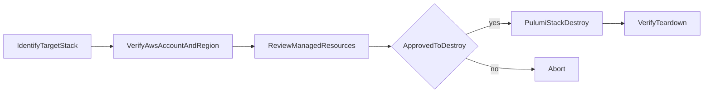

# Destroy and Teardown Runbook

This runbook defines safe teardown behavior for Shinobi-managed stacks.

## Purpose

- Provide a controlled destroy workflow.
- Reduce accidental data loss.
- Make teardown auditable and repeatable.

## Scope

Current Shinobi CLI does not provide a dedicated `destroy` command. This runbook uses Pulumi stack operations as the teardown mechanism after a Shinobi deploy.

## Preconditions

- You know the exact stack name to destroy.
- You have confirmed environment and account context.
- You have required approvals for target environment.
- You have verified backup/data retention requirements for stateful resources.

## Guardrails

- Never destroy production without explicit approval and backup confirmation.
- Always run a preview-style review before destroy.
- Confirm stack identity twice before execution.

## Teardown Flow



## Step-by-Step Procedure

## 1) Identify stack

Shinobi deployer stack naming defaults to:

`<serviceName>-<region>`

If custom names were used, use that exact stack name.

## 2) Verify account and region

Confirm shell context:

```bash
echo "$AWS_REGION"
```

Use your normal AWS identity check process before continuing.

## 3) Review current stack state

List and inspect the target stack resources with Pulumi tooling in the appropriate workspace context.

## 4) Execute destroy

Use Pulumi stack destroy for the selected stack.

Note:
- Use non-interactive mode in automation contexts.
- Capture command output in CI/job logs for audit.

## 5) Verify cleanup

- Confirm stack resources are removed.
- Confirm expected external dependencies (if any) are unaffected.
- Confirm no unexpected resources remain.

## Environment Policy

| Environment | Destroy Policy |
|---|---|
| development | Allowed with operator confirmation |
| staging | Allowed with release owner approval |
| production | Exception-only with explicit approval and backup proof |

## Data Safety Checklist

- DynamoDB backup/retention checked.
- S3 retention/backups checked.
- Downstream systems informed (if integrated).
- Post-destroy validation completed.

## TDD Gate for Future CLI Destroy Support

If a native Shinobi `destroy` command is implemented:

1. **Red**: add failing command tests for stack resolution, approval gates, and failure handling.
2. **Green**: implement minimal command path.
3. **Refactor**: improve UX/logging without changing behavior.

Required tests:
- safe default behavior
- explicit confirmation requirements
- environment policy enforcement
- deterministic error messages
