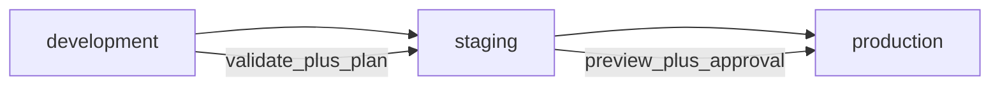

# Environment Matrix

This matrix defines how Shinobi should be operated across development, staging, and production for the current MVP.

## Purpose

- Make environment expectations explicit.
- Standardize safe promotion flow.
- Reduce accidental production drift.

## Environment Overview

| Dimension | development | staging | production |
|---|---|---|---|
| Goal | Fast iteration | Release candidate validation | Stable customer-facing runtime |
| Manifest source | feature branch/local | release branch | main/release tag |
| Policy pack default | Baseline | FedRAMP-Moderate | FedRAMP-High (or approved policy) |
| Apply mode | frequent, controlled | scheduled or gated | strictly gated |
| Preview required | yes | yes | yes (mandatory) |
| Manual approval | optional | required | required |
| Test gate | package tests touched by change | full test matrix | full test matrix + smoke |
| Rollback expectation | quick re-apply known good | re-apply known good | controlled rollback plan |
| Harmony apply flag | disabled | disabled (unless gated trial) | disabled by default; gated enable only |
| Harmony wrapper mode | enabled for integration testing | enabled | enabled |

## Promotion Flow



## Command Matrix

Harmony envelope validation examples (all environments):

```bash
node packages/cli/dist/main.js validate <manifest.yaml> --harmony-envelope --trace-id <trace-id>
node packages/cli/dist/main.js plan <manifest.yaml> --harmony-envelope --trace-id <trace-id>
```

## Development

```bash
node packages/cli/dist/main.js validate <manifest.yaml>
node packages/cli/dist/main.js plan <manifest.yaml> --region <region>
node packages/cli/dist/main.js up <manifest.yaml> --region <region> --code-path <lambda.zip>
```

Apply in dev only when preview output matches intent.

## Staging

```bash
pnpm nx run-many -t test --skipNxCache
node packages/cli/dist/main.js validate <manifest.yaml> --policy-pack FedRAMP-Moderate
node packages/cli/dist/main.js plan <manifest.yaml> --region <region> --policy-pack FedRAMP-Moderate --preview
node packages/cli/dist/main.js up <manifest.yaml> --region <region> --code-path <lambda.zip> --no-dry-run --policy-pack FedRAMP-Moderate
```

## Production

```bash
pnpm nx run-many -t test --skipNxCache
node packages/cli/dist/main.js validate <manifest.yaml> --policy-pack FedRAMP-High
node packages/cli/dist/main.js plan <manifest.yaml> --region <region> --policy-pack FedRAMP-High --preview
node packages/cli/dist/main.js up <manifest.yaml> --region <region> --code-path <lambda.zip> --no-dry-run --policy-pack FedRAMP-High
```

Production requires manual approval after preview review.

Promotion to restricted apply also requires passing `docs/operations/harmony-rollout-checklist.md`.

## TDD Expectations by Environment

- **Development**: Red-Green-Refactor for all behavior changes.
- **Staging**: Include integration-oriented tests for changed boundaries.
- **Production**: No direct behavior changes without passing dev/staging TDD evidence and full regression gate.

## Known MVP Caveats

- Network intent lowering currently emits warning diagnostics and does not produce deployable network resources.
- Telemetry intents are currently ignored by the AWS adapter.

## Recommended Environment Variables

| Variable | Use |
|---|---|
| `AWS_REGION` | Region selection |
| `AWS_ACCESS_KEY_ID` | AWS auth |
| `AWS_SECRET_ACCESS_KEY` | AWS auth |
| `SHINOBI_RUN_PULUMI_SMOKE` | Enables optional non-mocked smoke tests when set to `true` |

## Ownership and Controls

- Development owner: feature author
- Staging owner: release engineer or platform owner
- Production owner: platform owner with approval from designated reviewer

Keep this matrix updated whenever policy defaults, deploy gates, or runtime caveats change.
