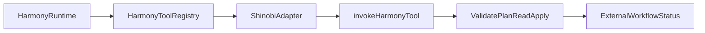
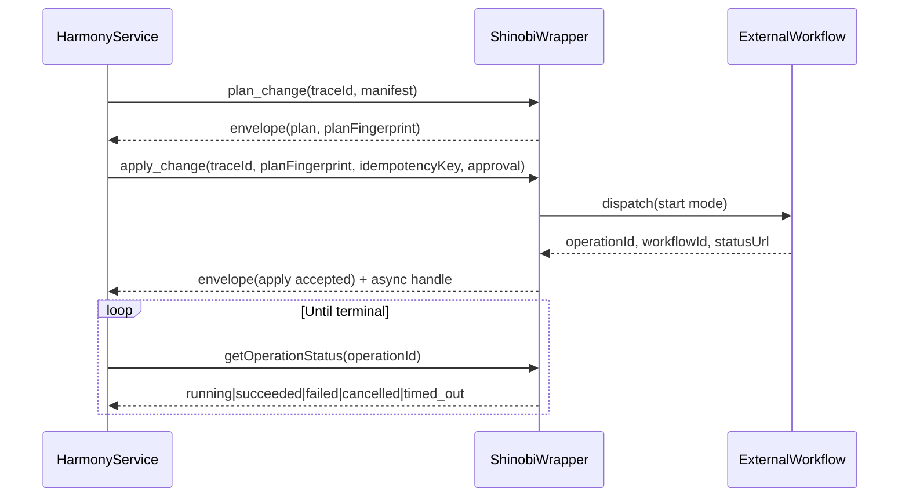

# Harmony Integration User Guide

This guide is the practical, copy-runnable path to integrate Shinobi into Harmony.

If you are asking "what do I do next in my codebase?", this is the document to follow.

Normative references:

- `docs/operations/harmony-integration.md`
- `docs/standards/agent-tool-protocol.md`
- `docs/standards/observability-audit.md`
- `docs/operations/harmony-go-live-gates.md`

## Who this guide is for

- Harmony platform engineers wiring tool execution.
- Operators enabling restricted apply safely.
- Release owners validating go/no-go posture.

## Integration model

Harmony integrates to Shinobi at a runtime boundary:

1. Harmony calls a Shinobi-backed tool surface.
2. Shinobi wrapper returns deterministic envelopes.
3. Restricted apply uses async handles and external workflow/status wiring.



## Pre-integration checklist

- Shinobi repo is available to the runtime that serves Harmony tools.
- Node + pnpm are installed where wrapper code runs.
- AWS and Pulumi prerequisites are met for apply execution environments.
- You can run:
  - `pnpm nx build cli`
  - `pnpm nx test cli --skipNxCache`
- Gate posture is green in:
  - `docs/operations/harmony-go-live-gates.md`
  - `docs/operations/harmony-rollout-dashboard.md`

## Step 1: Wire Harmony tool IDs to Shinobi wrapper

This repository is currently workspace-first and is not packaged for external npm consumption.
For a separate Harmony repo, integrate through a runtime boundary:

- CLI subprocess execution, or
- a small HTTP wrapper service in front of Shinobi.

### Option A: CLI subprocess bridge (fastest for separate repo)

```typescript
import { spawn } from "node:child_process";

const SHINOBI_MAIN = "/absolute/path/to/Shinobi-wan/packages/cli/dist/main.js";

export function runShinobiPlan(manifestPath: string, traceId: string): Promise<unknown> {
  return new Promise((resolve, reject) => {
    const proc = spawn("node", [SHINOBI_MAIN, "plan", manifestPath, "--json"], {
      env: { ...process.env, SHINOBI_TRACE_ID: traceId },
      stdio: ["ignore", "pipe", "pipe"],
    });
    let stdout = "";
    let stderr = "";
    proc.stdout.on("data", (chunk) => {
      stdout += String(chunk);
    });
    proc.stderr.on("data", (chunk) => {
      stderr += String(chunk);
    });
    proc.on("close", (code) => {
      if (code !== 0) {
        reject(new Error(`shinobi plan failed (exit ${code}): ${stderr}`));
        return;
      }
      resolve(JSON.parse(stdout));
    });
  });
}
```

### Option B: HTTP wrapper service (recommended for production separation)

- Deploy Shinobi wrapper in its own service boundary.
- Harmony calls wrapper endpoints like:
  - `POST /tools/invoke` for `validate_plan|plan_change|read_*|apply_change`
  - `GET /operations/:operationId` for async status.
- Wrapper internally calls `invokeHarmonyTool(...)` and `getOperationStatus(...)`.

This keeps Harmony and Shinobi loosely coupled, versionable, and independently deployable.

Tool IDs must match exactly:

- `golden.shinobi.validate_plan`
- `golden.shinobi.plan_change`
- `golden.shinobi.read_entities`
- `golden.shinobi.read_activity`
- `golden.shinobi.apply_change`
- `golden.shinobi.rollback_change`

## Step 2: Configure required environment

Set these in the runtime where Harmony invokes Shinobi tools:

```bash
export SHINOBI_WRAPPER_MODE_ENABLED=true
export SHINOBI_APPLY_ENABLED=true
export SHINOBI_APPLY_MODE=start

export SHINOBI_HARMONY_WORKFLOW_NAME=shinobi-apply-workflow
export SHINOBI_HARMONY_TASK_QUEUE=shinobi-apply-queue
export SHINOBI_HARMONY_STATUS_BASE_URL=https://harmony.example.internal
export SHINOBI_HARMONY_DISPATCH_URL=https://harmony.example.internal/operations/dispatch

export SHINOBI_APPROVAL_REQUIRED=true
export SHINOBI_APPROVAL_MAX_SLA_MINUTES=60

export SHINOBI_TOOL_VERSION=1.2.3
export SHINOBI_CONTRACT_VERSION=1.0.0
```

For read/plan-only pilot, set:

```bash
export SHINOBI_APPLY_ENABLED=false
```

## Step 3: Validate request contract from Harmony

### 3.1 Validate + plan

Request:

```json
{
  "toolId": "golden.shinobi.plan_change",
  "traceId": "trace-001",
  "input": {
    "manifestPath": "examples/lambda-sqs.yaml",
    "region": "us-east-1"
  }
}
```

Expected response shape (success):

- `metadata.operationClass = "plan"`
- `data.planFingerprint` is present
- `policy.operationClass = "plan"`

### 3.2 Apply (restricted, async start mode)

Request must include:

- `planFingerprint`
- `idempotencyKey`
- `approval` evidence object

Example:

```json
{
  "toolId": "golden.shinobi.apply_change",
  "traceId": "trace-002",
  "input": {
    "manifestPath": "examples/lambda-sqs.yaml",
    "mode": "start",
    "planFingerprint": "sha256-plan-fingerprint",
    "idempotencyKey": "idem-2026-02-17-001",
    "approval": {
      "approvalId": "apr-1001",
      "approverRole": "harmony-release-manager",
      "approverId": "user-123",
      "decision": "approved",
      "decidedAt": "2026-02-17T08:00:00.000Z",
      "slaMinutes": 30
    }
  }
}
```

Expected apply success response:

- Envelope `success=true`, `operationClass="apply"`.
- `handle.operationId`, `handle.workflowId`, `handle.statusUrl` present.
- `handle.terminalStates` includes `succeeded|failed|cancelled|timed_out`.

### 3.3 Status polling

Use `getOperationStatus(operationId)` until terminal state.

Terminal state retryability:

- `succeeded`: not retryable
- `failed`: retryable
- `cancelled`: retryable
- `timed_out`: retryable

## Step 4: Implement Harmony-side execution flow



## Step 5: Enforce safety and audit in Harmony

For every request:

- Generate and pass one `traceId`.
- Persist `toolId`, `traceId`, operation class, and decision outcome.
- For restricted apply, persist approval evidence with the same trace.

Do not:

- Retry side-effecting apply automatically without a valid idempotency key.
- Silent-downgrade apply to non-mutating behavior.
- Continue apply when workflow wiring is missing.

## Step 6: Run production-readiness checks

Before enabling restricted apply:

1. `pnpm nx test cli --skipNxCache`
2. `pnpm docs:check`
3. `pnpm roadmap:check`
4. `pnpm rollout:dashboard:check`
5. Verify all gates are `pass` in `docs/operations/harmony-go-live-gates.md`
6. Verify decision package in `docs/operations/harmony-go-no-go-decision.md`

## Failure map (what Harmony should do)

| Error code | Meaning | Harmony action |
|---|---|---|
| `APPROVAL_REQUIRED` | restricted operation missing approval evidence or apply disabled | stop, request/attach approval evidence |
| `INPUT_VALIDATION_FAILED` | request contract invalid (manifest, fingerprint, idempotency) | fix request and retry |
| `CONFLICT` | `planFingerprint` mismatch | re-run plan and re-approve apply |
| `DEPENDENCY_UNAVAILABLE` | workflow wiring/dispatch path unavailable | keep read/plan active, retry later with same idempotency semantics |
| `RUNNER_ERROR` | wrapper/runtime issue | fail fast and page operator |

## Common integration mistakes

- Tool ID mismatch (`plan-change` vs `golden.shinobi.plan_change`).
- Missing `approval` payload for apply when `SHINOBI_APPROVAL_REQUIRED=true`.
- Missing workflow env vars while `mode=start`.
- Reusing stale `planFingerprint` after manifest/region/policy changes.
- Dropping `traceId` between Harmony logs and Shinobi request envelope.

## Go-live playbook (copy this checklist)

- [ ] Wrapper path enabled (`SHINOBI_WRAPPER_MODE_ENABLED=true`).
- [ ] Read/plan tools pass in pilot and emit deterministic envelopes.
- [ ] Harmony persists `traceId` and envelope metadata for all calls.
- [ ] Apply wiring env vars are configured and reachable.
- [ ] Apply requests include approval evidence + idempotency key.
- [ ] Async status polling and terminal handling are implemented.
- [ ] Go/no-go package has explicit shared sign-off.

## Where to look next

- Contract details: `docs/operations/harmony-integration.md`
- Runtime operations: `docs/operations/runbook.md`
- Gate state: `docs/operations/harmony-go-live-gates.md`
- Decision package: `docs/operations/harmony-go-no-go-decision.md`
