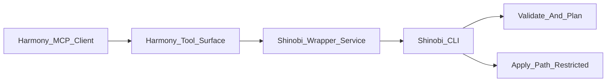

# Harmony Integration Guide

This guide describes how Shinobi is integrated into Harmony as an MCP-first tool surface with a wrapper/service execution boundary.

For operator-focused setup and copy-runnable integration steps, see:

- `docs/operations/harmony-integration-user-guide.md`

Normative contract source of truth: `packages/cli/src/integration/contract.ts`.

## Architecture

## Tool Catalog and Mapping

| Harmony Tool ID | Operation Class | Shinobi Mapping | Mode | Restriction |
|---|---|---|---|---|
| `golden.shinobi.validate_plan` | `plan` | `shinobi validate <manifest> --json [--policy-pack <pack>]` | `await` | non-restricted |
| `golden.shinobi.plan_change` | `plan` | `shinobi plan <manifest> --json [--region <r>] [--code-path 
] [--policy-pack <pack>]` | `await` | non-restricted |
| `golden.shinobi.read_entities` | `read` | wrapper-derived projection from validate/plan outputs | `await` | non-restricted |
| `golden.shinobi.read_activity` | `read` | wrapper-derived projection from validate/plan diagnostics | `await` | non-restricted |
| `golden.shinobi.apply_change` | `apply` | `shinobi up <manifest> --json --no-dry-run ...` | `start` default | restricted |
| `golden.shinobi.rollback_change` | `apply` | wrapper-managed compensation (native rollback not available) | `start` | restricted |

## Response Envelope Contract

Every Harmony-facing response uses a deterministic envelope with:

- `metadata.toolId`
- `metadata.operationClass` (`read | plan | apply`)
- `metadata.traceId`
- `metadata.toolVersion`
- `metadata.contractVersion`
- `policy` (timeout/retry/idempotency)
- `data` or `error`

`operationClass` is required in every response and must be one of `read | plan | apply`.

Error envelope fields:

- `code`
- `category`
- `retriable`
- `retriableReason` (required when `retriable=true`)
- `source`
- `traceId`
- `message`

## Timeout, Retry, and Idempotency Defaults

| Operation Class | Default Timeout | Max Timeout | Retry Policy | Idempotency |
|---|---|---|---|---|
| `read` | 5s | 15s | `2 attempts, 1s initial, x2 backoff` | recommended |
| `plan` | 10s | 30s | `2 attempts, 2s initial, x2 backoff` | required |
| `apply` | 30s (await override only) | 120s | `1 attempt (no auto side-effect retry)` | required |

## Restricted Operation Policy

`apply` and `rollback` tools are restricted and require:

- explicit approval flow,
- approver role validation from Harmony,
- approval evidence payload that includes:
  - requester context,
  - plan fingerprint,
  - policy summary,
  - blast-radius hint,
  - expiration.

## Async Apply Handle Contract

For `start` mode operations, wrapper dispatches to external workflow wiring and returns:

- `operationId`
- `traceId`
- `workflowId`
- `submittedAt`
- `statusUrl`
- `terminalStates` (`succeeded`, `failed`, `cancelled`, `timed_out`)
- optional `cancelUrl`

Terminal state semantics:

| State | Meaning | Retryable |
|---|---|---|
| `succeeded` | Operation completed and side effects committed | no |
| `failed` | Operation failed and did not reach success criteria | yes |
| `cancelled` | Operation cancelled by explicit control path | yes |
| `timed_out` | Operation exceeded execution timeout budget | yes |

## Plan-to-Apply Linkage

- `plan_change` responses include `planFingerprint`.
- `apply_change` requires `planFingerprint` and rejects requests when fingerprint is missing or mismatched.
- Apply remains blocked if Harmony wiring prerequisites are missing.

## Workflow Dispatch Wiring

`apply_change` in `start` mode requires active workflow dispatch wiring:

- `SHINOBI_HARMONY_WORKFLOW_NAME`
- `SHINOBI_HARMONY_TASK_QUEUE`
- `SHINOBI_HARMONY_STATUS_BASE_URL`
- `SHINOBI_HARMONY_DISPATCH_URL`

Behavior:

- Wrapper submits a dispatch request to `SHINOBI_HARMONY_DISPATCH_URL` including workflow/task-queue context and apply payload.
- Wrapper does not execute local in-process apply when `start` mode is requested.
- Operation status is retrieved from `${SHINOBI_HARMONY_STATUS_BASE_URL}/operations/{operationId}`.

## Envelope Compatibility Policy

- Additive fields: **minor** version.
- Field removals or type changes: **major** version.
- Golden compatibility tests are required for each release.

## Tenant, Security, and Audit Requirements

Required request context:

- `tenant_id`
- `initiatorId`
- `app_id`
- `environment`
- `classification`
- `trace_id`

Rules:

- no raw credentials in payloads,
- late-bound secret refs only,
- structured logs must include trace IDs and redact secret fields,
- audit records must preserve outcome/error class and approval linkage for restricted operations.

## Degraded Mode

- Validate/plan/read tools remain available when possible.
- If wrapper is unavailable, return deterministic temporary-unavailable error with retry hints.
- Do not silently downgrade from restricted apply into non-mutating behavior.
- If Harmony wiring specifics are missing, block apply enablement and continue read/plan.

## Feature Flags

| Key | Purpose | Default |
|---|---|---|
| `SHINOBI_WRAPPER_MODE_ENABLED` | Enables wrapper tool invocation path | `false` |
| `SHINOBI_APPLY_ENABLED` | Enables restricted apply tool execution | `false` |
| `SHINOBI_APPLY_MODE` | Default apply mode (`start` or `await`) | `start` |
| `SHINOBI_HARMONY_DISPATCH_URL` | External workflow dispatch endpoint for apply start mode | unset |
| `SHINOBI_CONTRACT_VERSION` | Envelope contract version string | `1.0.0` |
| `SHINOBI_TOOL_VERSION` | Tool implementation version string | `0.1.0` |
| `SHINOBI_MAX_CONCURRENCY` | Safety throttle value for wrapper workers | `5` |

## Rollout Sequence

1. Enable wrapper mode and ship read/plan tools.
2. Validate SLOs and error budget in pilot.
3. Enable apply only after gate checklist passes.
4. Keep rollback tool as wrapper-managed compensation until native contract exists.
