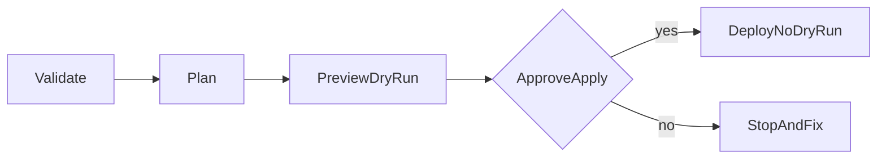

# Operations Runbook

This runbook is the operator-facing guide for validating, planning, previewing, deploying, and checking Shinobi MVP workloads on AWS.

For Harmony-specific wrapper integration details, see `docs/operations/harmony-integration.md`.

## Scope

This runbook covers:

- CLI-driven workflows (`validate`, `plan`, `up`)
- Dry-run preview and real deploy
- Basic triage for common failures
- Safe rollback posture for MVP
- Harmony wrapper/MCP rollout controls and restricted apply behavior

## Preconditions

- Dependencies installed: `pnpm install`
- CLI built: `pnpm nx build cli`
- AWS credentials present in shell:
  - `AWS_ACCESS_KEY_ID`
  - `AWS_SECRET_ACCESS_KEY`
  - `AWS_REGION`
- Pulumi CLI available in `PATH`
- A lambda artifact exists for deploys that create Lambda:
  - Example: `/absolute/path/to/lambda.zip`

## Execution Flow



## Standard Commands

## 1) Validate manifest

```bash
node packages/cli/dist/main.js validate examples/lambda-sqs.yaml
```

Success criteria:
- Validation result is `SUCCESS`
- Errors list is empty

## 2) Generate plan

```bash
node packages/cli/dist/main.js plan examples/lambda-sqs.yaml --region us-east-1
```

Success criteria:
- Plan result is `SUCCESS`
- Resources list is non-empty for non-trivial manifests

## 3) Preview (default safe mode)

```bash
node packages/cli/dist/main.js up examples/lambda-sqs.yaml --region us-east-1 --code-path /absolute/path/to/lambda.zip
```

Success criteria:
- Message includes `Preview complete`
- `deployed` is `false`

## 4) Apply (real deploy)

```bash
node packages/cli/dist/main.js up examples/lambda-sqs.yaml --region us-east-1 --code-path /absolute/path/to/lambda.zip --no-dry-run
```

Success criteria:
- Message includes `Deployed`
- Stack name is returned
- Outputs are printed when available

## TDD and Change Safety Gates

Use this when you modify manifests, binders, lowerers, or policy logic.

1. **Red**: add/update tests for expected behavior change.
2. **Green**: make minimal code/config change to pass.
3. **Refactor**: clean structure while keeping tests green.

Required checks before production apply:

- `pnpm nx run-many -t test --skipNxCache`
- `validate` command on target manifest
- `plan` command confirms expected resources
- `up` preview confirms expected change shape

## Common Failure Modes

## AWS credential failure

Symptom:
- Preview/deploy fails with `aws-credentials` style message.

Action:
- Re-export AWS credentials in current shell.
- Re-run preview before apply.

## Pulumi runtime/plugin failure

Symptom:
- Error category suggests pulumi runtime/load plugin issue.

Action:
- Verify Pulumi CLI installation and shell visibility.
- Re-run `plan` and preview.

## Unresolved ref failure

Symptom:
- Error includes `Unresolved ref` or `Unresolved output`.

Action:
- Check manifest binding references and generated resource linkage.
- Ensure source/target nodes and binding config fields match supported patterns.

## Policy non-compliance

Symptom:
- Validation succeeds structurally but policy says non-compliant.

Action:
- Inspect violation list and remediation guidance.
- Fix manifest intent shape (scope/actions/conditions) and re-run validate/plan.

## Operational Caveats (Current MVP)

- Network intents are recorded and surfaced as warnings; they are not currently lowered to deployable network resources.
- Telemetry intents are currently skipped by the AWS adapter.

## Rollback and Recovery (MVP)

Current rollback approach:

1. Stop new applies.
2. Re-run preview to inspect pending change set.
3. Re-apply known-good manifest version.

For destructive rollback flows, add explicit destroy orchestration only after review and policy guardrails are in place.

## Post-Deploy Verification Checklist

- Lambda function exists and has expected runtime/handler.
- Queue/table/bucket/API resources exist per manifest.
- Stack outputs are present and non-empty where expected.
- Application-level smoke check succeeds (invoke lambda or hit API endpoint).

## Harmony Integration Operations

For Harmony integration rollout:

1. Follow `docs/operations/harmony-rollout-checklist.md`.
2. Use `docs/operations/harmony-release-gate-checklist.md` as the single go/no-go gate source.
3. Track go/no-go outcomes in `docs/operations/harmony-go-live-gates.md`.
4. Keep apply disabled (`SHINOBI_APPLY_ENABLED=false`) during read/plan pilot.
5. Require restricted approval evidence before enabling apply.
6. Use `--harmony-envelope --trace-id <id>` on CLI commands when validating envelope shape in non-production.
7. Update weekly gate evidence in `docs/operations/harmony-gate-evidence.md` using `on-track|at-risk|blocked`.
8. Regenerate dashboard view with `pnpm rollout:dashboard`.
9. Enforce approval evidence in restricted apply mode:
   - `SHINOBI_APPROVAL_REQUIRED=true`
   - `SHINOBI_APPROVAL_MAX_SLA_MINUTES=<threshold>`
10. Keep decision package current:
   - `docs/operations/harmony-go-no-go-decision.md`
   - update sign-off record when gates or risk posture change.
