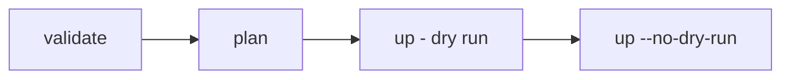

# Shinobi CLI Reference

This guide documents user-facing CLI workflows for validating manifests, generating plans, previewing infrastructure changes, and deploying to AWS.

## Overview

Shinobi CLI supports three primary commands:

- `validate`: parse + compile + policy evaluation
- `plan`: validate + adapter lowering + resource plan generation
- `up`: plan + Pulumi preview (default) or apply (`--no-dry-run`)



## Build and Run

Build the CLI once:

```bash
pnpm nx build cli
```

Use it directly via Node:

```bash
node packages/cli/dist/main.js <command> [options]
```

## Command: `validate`

Validate manifest structure and compile-time policy posture.

```bash
node packages/cli/dist/main.js validate <manifest> [options]
```

### Options

- `--json`: machine-readable JSON output
- `--policy-pack <pack>`: override manifest policy pack (`Baseline`, `FedRAMP-Moderate`, `FedRAMP-High`)
- `--harmony-envelope`: emit Harmony-compatible envelope output
- `--trace-id <traceId>`: attach a correlation trace identifier for envelope mode

### Example

```bash
node packages/cli/dist/main.js validate examples/lambda-sqs.yaml --policy-pack Baseline
```

## Command: `plan`

Generate a deployment plan after successful validation/lowering.

```bash
node packages/cli/dist/main.js plan <manifest> [options]
```

### Options

- `--region <region>`: AWS region (default `us-east-1`)
- `--code-path <path>`: Lambda artifact path used by lowering/deploy flows
- `--preview`: run Pulumi preview after generating the plan
- `--json`: machine-readable JSON output
- `--policy-pack <pack>`: override manifest policy pack
- `--harmony-envelope`: emit Harmony-compatible envelope output
- `--trace-id <traceId>`: attach a correlation trace identifier for envelope mode

### Example

```bash
node packages/cli/dist/main.js plan examples/lambda-sns.yaml --region us-east-1 --json
```

## Command: `up`

Preview or deploy resources from a manifest.

```bash
node packages/cli/dist/main.js up <manifest> [options]
```

### Options

- `--region <region>`: AWS region (default `us-east-1`)
- `--code-path <path>`: Lambda artifact path
- `--no-dry-run`: perform real apply (default mode is dry-run/preview)
- `--json`: machine-readable summary output
- `--policy-pack <pack>`: override manifest policy pack
- `--harmony-envelope`: emit Harmony-compatible envelope output
- `--trace-id <traceId>`: attach a correlation trace identifier for envelope mode

### Examples

Preview (safe default):

```bash
node packages/cli/dist/main.js up examples/lambda-sqs.yaml --region us-east-1 --code-path /absolute/path/to/lambda.zip
```

Apply deployment:

```bash
node packages/cli/dist/main.js up examples/lambda-sqs.yaml --region us-east-1 --code-path /absolute/path/to/lambda.zip --no-dry-run
```

## Exit Code Behavior

- `0`: command succeeded
- `1`: command failed due to validation, policy, lowering, preview, or deploy errors

## Output Modes

- Human-readable text is the default
- `--json` omits heavy compile internals and is suited for scripts
- `--harmony-envelope` emits envelope-compatible payloads for Harmony integrations

## Typical User Workflow

1. Author or update a manifest (`examples/` + cookbook patterns are good starting points).
2. Run `validate`.
3. Run `plan`.
4. Run `up` (dry-run preview).
5. Run `up --no-dry-run` only after preview confidence.

## Troubleshooting

- Credentials errors: verify `AWS_ACCESS_KEY_ID`, `AWS_SECRET_ACCESS_KEY`, and region settings.
- Preview/apply failures: inspect command output for Pulumi errors and adapter diagnostics.
- Missing references in bindings: ensure `source`/`target` IDs exist and reference keys are valid.

## Related Docs

- `README.md`
- `docs/getting-started.md`
- `docs/user/manifest-authoring-guide.md`
- `docs/cookbook/manifest-patterns.md`
