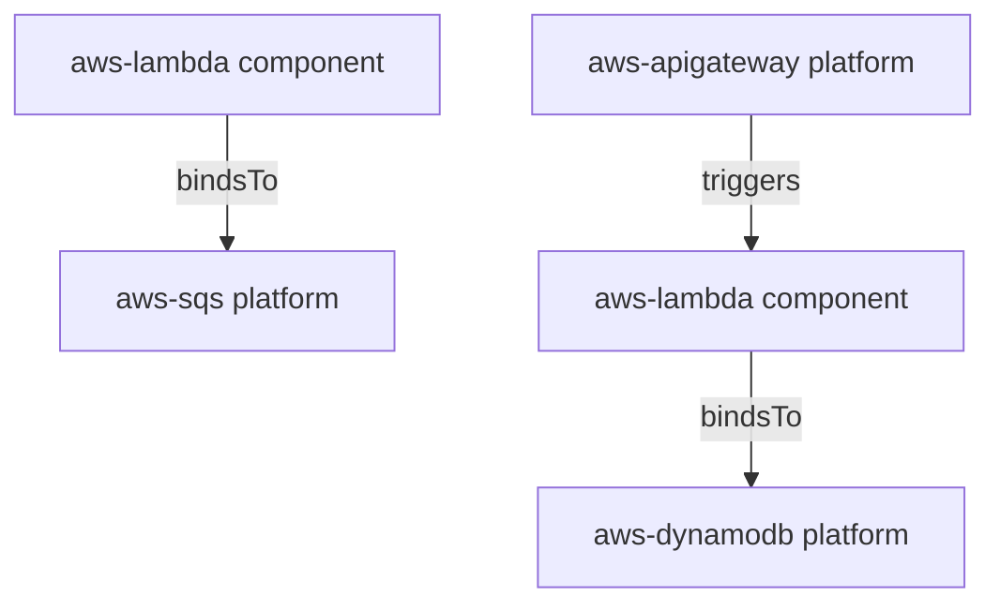

# Manifest Authoring Guide

This guide helps users author valid Shinobi manifests, choose supported patterns, and move safely from `validate` to `plan` to deployment.

## Manifest Purpose

A manifest describes:

- the service identity (`service`)
- infrastructure/application nodes (`components`)
- relationships between nodes (`bindings`)
- optional compliance mode (`policyPack`)

Shinobi compiles this into deterministic graph state, intents, policy results, and deployable AWS plans.

## Minimal Manifest Shape

```yaml
service: my-service
components:
  - id: worker
    type: component
    platform: aws-lambda
bindings: []
policyPack: Baseline
```

## Required Fields by Section

### `service`

- Required string
- Should be stable across environments unless intentionally creating separate stacks

### `components[]`

Each component entry should include:

- `id`: unique node identifier
- `type`: `component` or `platform`
- `platform`: supported platform identifier (for example `aws-lambda`, `aws-sqs`)
- `config`: optional platform-specific config object

### `bindings[]`

Each binding entry should include:

- `source`: component ID that initiates the relationship
- `target`: component ID being referenced
- `type`: relationship type (for example `bindsTo`, `triggers`)
- `config.resourceType`: required resource class hint for binder behavior

## Supported MVP Platforms

- `aws-lambda`
- `aws-sqs`
- `aws-sns`
- `aws-dynamodb`
- `aws-s3`
- `aws-apigateway`

## Common Binding Patterns



## Example: Lambda to SQS

```yaml
service: my-lambda-sqs
components:
  - id: api-handler
    type: component
    platform: aws-lambda
    config:
      runtime: nodejs20.x
      handler: index.handler
      memorySize: 256
      timeout: 30
  - id: work-queue
    type: platform
    platform: aws-sqs
bindings:
  - source: api-handler
    target: work-queue
    type: bindsTo
    config:
      resourceType: queue
      accessLevel: write
      configKeys:
        - key: QUEUE_URL
          valueSource:
            type: reference
            nodeRef: work-queue
            field: url
policyPack: Baseline
```

## Authoring Workflow

1. Start from an example in `examples/` or a pattern in `docs/cookbook/manifest-patterns.md`.
2. Set stable IDs for each component and binding relationship.
3. Add binding config with explicit `resourceType`.
4. Run `validate` and fix schema/semantic issues.
5. Run `plan` and inspect generated resources.
6. Run `up` preview before using `--no-dry-run`.

## Validation Checklist

- Every `components[].id` is unique.
- Every `bindings[].source` and `bindings[].target` points to existing IDs.
- Every binding includes `config.resourceType`.
- Reference keys (`nodeRef` and `field`) align to expected target outputs.
- Policy pack is explicitly set when environment controls require it.

## Known MVP Caveats

- Network intents from binding config are accepted but currently warning-only in adapter lowering.
- Telemetry intents are currently skipped by adapter lowering.

## Commands to Verify a Manifest

```bash
node packages/cli/dist/main.js validate examples/lambda-sqs.yaml
node packages/cli/dist/main.js plan examples/lambda-sqs.yaml --region us-east-1
node packages/cli/dist/main.js up examples/lambda-sqs.yaml --region us-east-1 --code-path /absolute/path/to/lambda.zip
```

## Related Docs

- `README.md`
- `docs/getting-started.md`
- `docs/user/cli-reference.md`
- `docs/cookbook/manifest-patterns.md`
